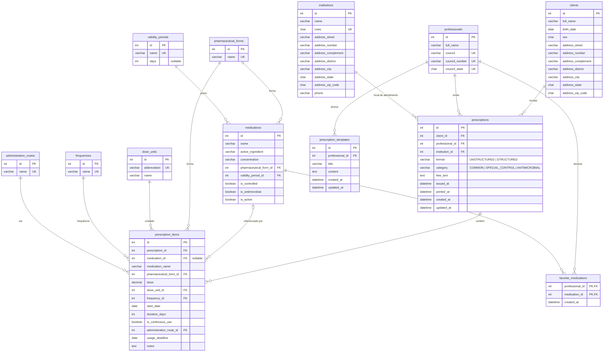

# DER - Prescrição médica

```mermaid
erDiagram
    clients ||--o{ prescriptions : "recebe"
    professionals ||--o{ prescriptions : "emite"
    institutions ||--o{ prescriptions : "local de atendimento"
    prescriptions ||--o{ prescription_items : "contém"
    medications |o--o{ prescription_items : "referenciado por"
    pharmaceutical_forms ||--o{ medications : "forma"
    validity_periods ||--o{ medications : "prazo"
    pharmaceutical_forms ||--o{ prescription_items : "forma"
    dose_units ||--o{ prescription_items : "unidade"
    frequencies ||--o{ prescription_items : "frequência"
    administration_routes ||--o{ prescription_items : "via"
    professionals ||--o{ favorite_medications : "favorita"
    medications ||--o{ favorite_medications : "favoritado"
    professionals ||--o{ prescription_templates : "possui"

    clients {
        int id PK
        varchar full_name
        date birth_date
        char sex
        varchar address_street
        varchar address_number
        varchar address_complement
        varchar address_district
        varchar address_city
        char address_state
        char address_zip_code
    }

    professionals {
        int id PK
        varchar full_name
        varchar council UK
        varchar council_number UK
        char council_state UK
    }

    institutions {
        int id PK
        varchar name
        char cnes UK
        varchar address_street
        varchar address_number
        varchar address_complement
        varchar address_district
        varchar address_city
        char address_state
        char address_zip_code
        varchar phone
    }

    medications {
        int id PK
        varchar name
        varchar active_ingredient
        varchar concentration
        int pharmaceutical_form_id FK
        int validity_period_id FK
        boolean is_controlled
        boolean is_antimicrobial
        boolean is_active
    }

    pharmaceutical_forms {
        int id PK
        varchar name UK
    }

    administration_routes {
        int id PK
        varchar name UK
    }

    dose_units {
        int id PK
        varchar abbreviation UK
        varchar name
    }

    validity_periods {
        int id PK
        varchar name UK
        int days "nullable"
    }

    frequencies {
        int id PK
        varchar name UK
    }

    prescriptions {
        int id PK
        int client_id FK
        int professional_id FK
        int institution_id FK
        varchar format "UNSTRUCTURED | STRUCTURED"
        varchar category "COMMON | SPECIAL_CONTROL | ANTIMICROBIAL"
        text free_text
        datetime issued_at
        datetime printed_at
        datetime created_at
        datetime updated_at
    }

    prescription_items {
        int id PK
        int prescription_id FK
        int medication_id FK "nullable"
        varchar medication_name
        int pharmaceutical_form_id FK
        decimal dose
        int dose_unit_id FK
        int frequency_id FK
        date start_date
        int duration_days
        boolean is_continuous_use
        int administration_route_id FK
        date usage_deadline
        text notes
    }

    favorite_medications {
        int professional_id PK, FK
        int medication_id PK, FK
        datetime created_at
    }

    prescription_templates {
        int id PK
        int professional_id FK
        varchar title
        text content
        datetime created_at
        datetime updated_at
    }
```
